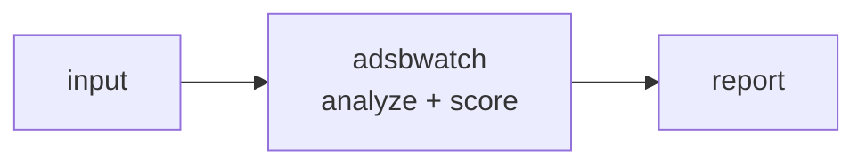

<a name="top"></a>
<div align="center">


# ADSBWATCH

### Analyze an ADS-B feed/CSV for anomalies: callsign spoofing, squawk 7500/7600/7700, and unusual loiter patterns.


[](https://pypi.org/project/cognis-adsbwatch/) [](https://github.com/cognis-digital/adsbwatch/actions) [](LICENSE) [](https://github.com/cognis-digital)

*Part of the Cognis Neural Suite.*

</div>

```bash
pip install cognis-adsbwatch
adsbwatch scan .            # → prioritized findings in seconds
```


<!-- cognis:example:start -->
## 🔎 Example output

Real, reproducible output from the tool — runs offline:

```console
$ adsbwatch-emit --version
adsbwatch 0.3.0
```

```console
$ adsbwatch-emit --help
usage: adsbwatch [-h] [--version] {scan,assess,feeds} ...

Defensive OSINT analysis of an ADS-B feed for anomalies (emergency squawks,
callsign spoofing, loiter patterns).

positional arguments:
  {scan,assess,feeds}
    scan               Scan an ADS-B CSV feed for anomalies.
    assess             Decision support: triage anomalies, correlate with
                       local sensor logs, and recommend operator actions
                       (advisory; human-in-the-loop, no effectors).
    feeds              Live ADS-B data-feed layer (OpenSky): list | update |
                       get <id> [--offline].

options:
  -h, --help           show this help message and exit
  --version            show program's version number and exit
```

> Blocks above are real `adsbwatch` output — reproduce them from a clone.

**Sample result format** _(illustrative values — run on your own data for real findings):_

```
{
"adsb": {
"type": "aircraft",
"icao24": "A12345",
"callsign": "XYZ456",
"latitude": 37.7749,
"longitude": -122.4194,
"altitude": 3000,
"velocity": 200,
"heading": 270
},
"findings": [
{
"id": "1",
"type": "aircraft-track",
"start_time": "2023-02-15T14:30:00Z",
"end_time": "2023-02-15T14:35:00Z"
}
]
}
```

<!-- cognis:example:end -->

## Usage — step by step

`adsbwatch` runs defensive OSINT analysis of an ADS-B feed (CSV) for anomalies — emergency squawks, callsign spoofing, and loiter patterns.

1. **Install** (Python 3.10+):
   ```bash
   pip install -e .            # or: pipx install adsbwatch
   ```
2. **Scan an ADS-B CSV feed** (human-readable table):
   ```bash
   adsbwatch scan feed.csv
   ```
3. **Tune loiter detection** (track radius, cumulative turn, min points):
   ```bash
   adsbwatch scan feed.csv --loiter-radius 5 --loiter-turn 270 --loiter-points 6
   ```
4. **Read the output** as JSON for piping / alerting:
   ```bash
   adsbwatch scan feed.csv --format json | jq '.anomalies'
   ```
   Or export the picture straight to maps and threat-intel platforms — native, zero-dep:
   ```bash
   adsbwatch scan feed.csv --format geojson > anomalies.geojson   # Leaflet/Mapbox/QGIS/kepler
   adsbwatch scan feed.csv --format stix    > anomalies.json       # STIX 2.1 bundle for OpenCTI/TIPs
   ```
   GeoJSON plots each geolocated anomaly (emergency squawks, spoofed callsigns,
   loiter orbits); STIX pairs a `location` + `observed-data` + `note` per anomaly
   in a `report`. (A live Finding stream to MISP/Splunk/Slack is in `adsbwatch.connect`.)
5. **Drive alerting in CI/cron** — exit `2` when anomalies are found, `0` when clean, `1` on parse error:
   ```yaml
   - run: pip install -e . && adsbwatch scan feed.csv   # exit 2 => trigger alert
   ```


## Live data feed — OpenSky, edge & air-gap ready

adsbwatch ships a real, stdlib-only data-feed layer that ingests **live ADS-B
state vectors** from the **OpenSky Network**, caches them to disk, and re-serves
that snapshot **offline** — so the tool keeps hunting anomalies on disconnected /
edge / air-gapped gear. The cached states are converted straight into the same
`Observation` rows the anomaly engine already scans, so a live emergency squawk
(7500/7600/7700), callsign spoof, or loiter orbit surfaces exactly as it would
from a CSV.

Only the single ADS-B-relevant feed is wired in — endpoints come from the
bundled catalog (`adsbwatch/data_feeds_2026.json`); nothing is invented:

| feed id          | source                                   | URL |
|------------------|------------------------------------------|-----|
| `opensky-states` | OpenSky Network — live aircraft states   | `https://opensky-network.org/api/states/all` |

```bash
adsbwatch feeds list                         # wired feed(s) + cache freshness
adsbwatch feeds update opensky-states        # fetch + cache the live snapshot
adsbwatch feeds get opensky-states           # ingest -> scan-ready summary
adsbwatch feeds get opensky-states --offline # serve cache only (no network)

adsbwatch scan --live                         # ingest live airspace + full scan
adsbwatch scan --live --region 24,-125,49,-66 # clip to a bounding box (CONUS)
adsbwatch scan --live --offline               # scan the last cached snapshot
```

### Air-gap / sneakernet workflow

```bash
# On a connected box: build a portable snapshot of the feed cache
COGNIS_FEEDS_CACHE=./snap adsbwatch feeds update opensky-states
python -m adsbwatch.datafeeds snapshot-export feeds.tar.gz

# Carry feeds.tar.gz across the air gap, then on the isolated box:
python -m adsbwatch.datafeeds snapshot-import feeds.tar.gz
adsbwatch scan --live --offline               # full anomaly scan, zero network
```

The cache location is `COGNIS_FEEDS_CACHE` (default `~/.cache/cognis-feeds`).
`--offline` never touches the network. OpenSky is keyless (anonymous access is
rate-limited; an account raises the limits). See `demos/04-live-feed/`.


## Contents

- [Why adsbwatch?](#why) · [Features](#features) · [Quick start](#quick-start) · [Example](#example) · [Architecture](#architecture) · [AI stack](#ai-stack) · [How it compares](#how-it-compares) · [Integrations](#integrations) · [Install anywhere](#install-anywhere) · [Related](#related) · [Contributing](#contributing)

<a name="why"></a>
## Why adsbwatch?

Analyze an ADS-B feed/CSV for anomalies: callsign spoofing, squawk 7500/7600/7700, and unusual loiter patterns. — without standing up heavyweight infrastructure.

`adsbwatch` is single-purpose, scriptable, and self-hostable: point it at a target, get prioritized results in the format your workflow already speaks (table · JSON · SARIF), gate CI on it, and let agents drive it over MCP.

<div align="right"><a href="#top">↑ back to top</a></div>

<a name="features"></a>
## Features

- ✅ ADS-B anomaly detection — emergency squawks (7500/7600/7700), callsign spoofing, loiter
- ✅ **Decision support (human-in-the-loop)** — `assess`: triage, multi-sensor correlation, advisory recommendations
- ✅ **Sensor correlation** — fuse alerts with local camera / RF / access-control logs on a timeline (evidence + pattern-of-life)
- ✅ Data sovereignty — fully local/offline, pure standard library; nothing leaves the box
- ✅ Runs on Linux/macOS/Windows · Docker · devcontainer
- ✅ Ports in Python, JavaScript, Go, and Rust (`ports/`)

### Decision support — the layer *above* the alert (human stays in command)

The sensor layer tells you *something happened*. `adsbwatch assess` is the decision
architecture above it — it **triages** anomalies by priority, **correlates** them with your
other local sensors (cameras, RF logs, access control) to build an evidence picture, and
**recommends courses of action to an operator** (log, notify, escalate to the responsible
authority, cross-cue a camera, request ID, preserve evidence).

```bash
adsbwatch assess feed.csv --sensors local_sensors.csv      # triage + correlate + recommend
adsbwatch assess feed.csv --format json                    # for your SOC / C2 dashboard
```

> **Boundary (by design and enforced by tests):** this is decision **support**, not decision
> **authority**. It produces recommendations and notifications for a *person* — it has **no
> interface to weapons, jammers, or any effector, and never acts autonomously**. Every
> recommended action requires human authorization. Use of force stays with a human.

<div align="right"><a href="#top">↑ back to top</a></div>

<a name="quick-start"></a>
## Quick start

```bash
pip install cognis-adsbwatch
adsbwatch --version
adsbwatch scan .                       # scan current project
adsbwatch scan . --format json         # machine-readable
adsbwatch scan . --fail-on high        # CI gate (non-zero exit)
```

<div align="right"><a href="#top">↑ back to top</a></div>

<a name="example"></a>
## Example

```text
$ adsbwatch scan .
  [HIGH    ] ADS-001  example finding             (./src/app.py)
  [MEDIUM  ] ADS-002  another signal              (./config.yaml)

  2 findings · risk score 5 · 38ms
```

<div align="right"><a href="#top">↑ back to top</a></div>

<a name="architecture"></a>
## Architecture



<div align="right"><a href="#top">↑ back to top</a></div>

<a name="ai-stack"></a>
## Use it from any AI stack

`adsbwatch` is interoperable with every popular way of using AI:

- **MCP server** — `adsbwatch mcp` (Claude Desktop, Cursor, Cognis.Studio, [uncensored-fleet](https://github.com/cognis-digital/uncensored-fleet))
- **OpenAI-compatible / JSON** — pipe `adsbwatch scan . --format json` into any agent or LLM
- **LangChain · CrewAI · AutoGen · LlamaIndex** — wrap the CLI/JSON as a tool in one line
- **CI / scripts** — exit codes + SARIF for non-AI pipelines

<div align="right"><a href="#top">↑ back to top</a></div>

<a name="how-it-compares"></a>
## How it compares

| | **Cognis adsbwatch** | typical tools |
|---|:---:|:---:|
| Self-hostable, no account | ✅ | varies |
| Single command, zero config | ✅ | ⚠️ |
| JSON + SARIF for CI | ✅ | varies |
| MCP-native (AI agents) | ✅ | ❌ |
| Polyglot ports (JS/Go/Rust) | ✅ | ❌ |
| Open license | ✅ COCL | varies |
<div align="right"><a href="#top">↑ back to top</a></div>

<a name="integrations"></a>
## Integrations

Pipes into your stack: **SARIF** for code-scanning, **JSON** for anything, an **MCP server** (`adsbwatch mcp`) for AI agents, and a webhook forwarder for SIEM/Slack/Jira. See [`docs/INTEGRATIONS.md`](docs/INTEGRATIONS.md).

<div align="right"><a href="#top">↑ back to top</a></div>

<a name="install-anywhere"></a>
## Install — every way, every platform

```bash
pip install "git+https://github.com/cognis-digital/adsbwatch.git"    # pip (works today)
pipx install "git+https://github.com/cognis-digital/adsbwatch.git"   # isolated CLI
uv tool install "git+https://github.com/cognis-digital/adsbwatch.git" # uv
pip install cognis-adsbwatch                                          # PyPI (when published)
docker run --rm ghcr.io/cognis-digital/adsbwatch:latest --help        # Docker
brew install cognis-digital/tap/adsbwatch                             # Homebrew tap
curl -fsSL https://raw.githubusercontent.com/cognis-digital/adsbwatch/main/install.sh | sh
```

| Linux | macOS | Windows | Docker | Cloud |
|---|---|---|---|---|
| `scripts/setup-linux.sh` | `scripts/setup-macos.sh` | `scripts/setup-windows.ps1` | `docker run ghcr.io/cognis-digital/adsbwatch` | [DEPLOY.md](docs/DEPLOY.md) (AWS/Azure/GCP/k8s) |

<div align="right"><a href="#top">↑ back to top</a></div>

<a name="related"></a>
## Related Cognis tools


**Explore the suite →** [🗂️ all 170+ tools](https://github.com/cognis-digital/cognis-neural-suite) · [⭐ awesome-cognis](https://github.com/cognis-digital/awesome-cognis) · [🔗 cognis-sources](https://github.com/cognis-digital/cognis-sources) · [🤖 uncensored-fleet](https://github.com/cognis-digital/uncensored-fleet) · [🧠 engram](https://github.com/cognis-digital/engram)

<div align="right"><a href="#top">↑ back to top</a></div>

<a name="contributing"></a>
## Contributing

PRs, new rules, and demo scenarios are welcome under the collaboration-pull model — see [CONTRIBUTING.md](CONTRIBUTING.md) and [SECURITY.md](SECURITY.md).

> ### ⭐ If `adsbwatch` saved you time, **star it** — it genuinely helps others find it.

## Interoperability

`{}` composes with the 300+ tool Cognis suite — JSON in/out and a shared
OpenAI-compatible `/v1` backbone. See **[INTEROP.md](INTEROP.md)** for the
suite map, composition patterns, and reference stacks.

## License

Source-available under the **Cognis Open Collaboration License (COCL) v1.0** — free for personal, internal-evaluation, research, and educational use; **commercial / production use requires a license** (licensing@cognis.digital). See [LICENSE](LICENSE).

---

<div align="center"><sub><b><a href="https://cognis.digital">Cognis Digital</a></b> · one of 170+ tools in the <a href="https://github.com/cognis-digital/cognis-neural-suite">Cognis Neural Suite</a> · <i>Making Tomorrow Better Today</i></sub></div>
