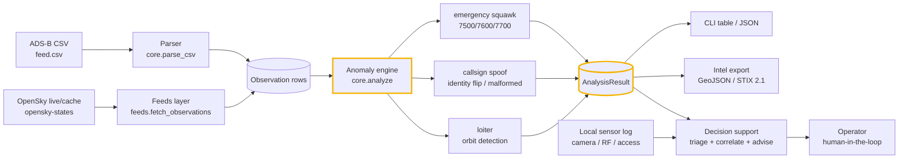
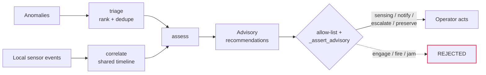

# Architecture

`adsbwatch` takes a stream of ADS-B position reports — from a local CSV or a
live OpenSky snapshot — and turns it into ranked, exportable, decision-ready
anomaly findings. Everything is pure standard library and runs offline. This
document explains how the pieces fit together.

## The pipeline

## Components

### Parser (`adsbwatch/core.py`)
`parse_csv` / `parse_records` read ADS-B observations into `Observation`
dataclasses. Columns are case-insensitive with aliases (`icao`/`hex`,
`callsign`/`flight`, `lat`/`latitude`, `altitude`/`alt`, `timestamp`/`time`).
Timestamps accept unix epoch seconds or ISO-8601. A missing ICAO is a hard
error; missing position/altitude/squawk are tolerated.

### Anomaly engine (`adsbwatch/core.py` → `analyze`)
Groups observations by aircraft (ICAO) and runs three detectors:

- **emergency_squawk** — flags the special transponder codes `7500`
  (unlawful interference / hijack), `7600` (radio failure), `7700` (general
  emergency). `7500`/`7700` are `critical`, `7600` is `high`.
- **callsign_spoof** — flags one ICAO hardware address broadcasting more than
  one distinct callsign (an identity flip, `high`) and malformed callsigns that
  fail the `^[A-Z0-9]{2,8}$` shape (`medium`).
- **loiter** — flags an orbit: a track that stays inside a small radius
  (`--loiter-radius`, default 5 NM) while accumulating heading change above a
  threshold (`--loiter-turn`, default 270°) over enough points
  (`--loiter-points`, default 6). Uses haversine distance and great-circle
  bearings, so it distinguishes circling from transiting.

Findings are returned in an `AnalysisResult`, sorted critical → low.

### Feeds layer (`adsbwatch/feeds.py` + `datafeeds.py`)
The edge/air-gap data path. `fetch_observations` pulls live ADS-B state vectors
from the OpenSky Network (`opensky-states`, the single wired catalog feed),
caches them to disk, and converts the `states/all` rows straight into the same
`Observation` shape the engine consumes. `offline=True` serves the cached
snapshot only and never touches the network, so the tool keeps working on
disconnected gear. Endpoints come from the bundled `data_feeds_2026.json` — no
invented URLs.

### Intel export (`adsbwatch/intel.py`)
Zero-dependency exporters that put findings where analysts work:

- **GeoJSON** — each geolocated anomaly as a `Point` Feature for
  Leaflet / Mapbox / QGIS / kepler.gl.
- **STIX 2.1** — a valid bundle pairing a `location` SDO with an
  `observed-data` + `note` per anomaly, grouped under a `report`; ingestible by
  OpenCTI and other TIPs.

Coordinates come from the anomaly's own evidence (a loiter `center`) or the
aircraft's last known position in the stream.

### Decision support (`adsbwatch/decision.py`)
The layer *above* the alert, with the human kept in command:

`triage` ranks and de-duplicates anomalies; `correlate` fuses them with other
local sensor logs (camera, RF, access-control) on a shared timeline to build
pattern-of-life and an evidence bundle; `recommend` emits advisory courses of
action. **Hard scope:** an allow-list (`_ALLOWED_ACTIONS`) plus `_assert_advisory`
and tests guarantee the layer only ever recommends sensing / notification /
evidence / escalation work. There is no interface to weapons, jammers, or
interceptors, and it never acts autonomously — `human_authorization_required`
is always `True`.

### CLI (`adsbwatch/cli.py`)
`scan` runs the engine over a CSV (or `--live` over OpenSky) and renders
`table` / `json` / `geojson` / `stix`. `assess` runs decision support with an
optional `--sensors` log. `feeds` manages the live data layer. Exit codes:
`0` = clean, `1` = usage/parse error, `2` = anomalies found (so it can drive
alerting in CI).

### Connect bridge (`adsbwatch/connect.py`)
Maps the JSON findings to the canonical cognis-connect `Finding` and forwards
them to STIX/TAXII, MISP, Sigma, Splunk, Elastic, Slack/Discord, or a webhook.
`cognis-connect` is a soft dependency.

## Why these choices

- **Stdlib, offline, no account.** The whole pipeline is a file you run; no
  daemon, no data leaving the box, works on an air-gapped sensor.
- **Same engine, many sources.** CSV today, live OpenSky tomorrow, a cached
  snapshot on the isolated box — the analysis code never changes.
- **Human in command by construction.** The decision layer's scope is enforced
  by an allow-list and tests, not by good intentions.

## Extend it

Add a detector in `core.py`, a test in `tests/`, and a demo scenario in
`demos/`. See [CONTRIBUTING.md](../CONTRIBUTING.md).
